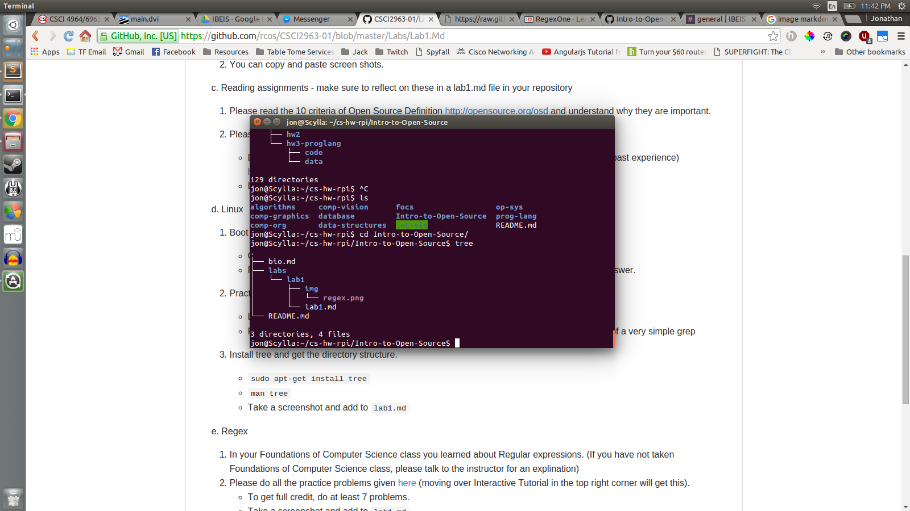
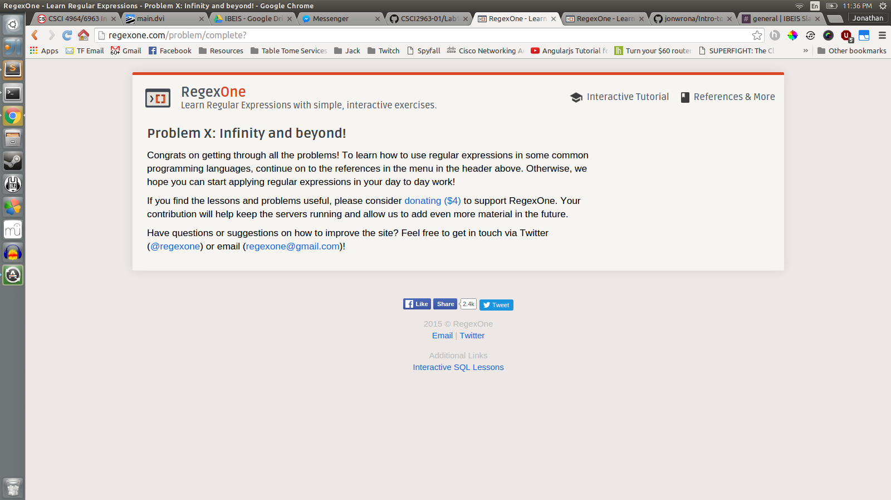
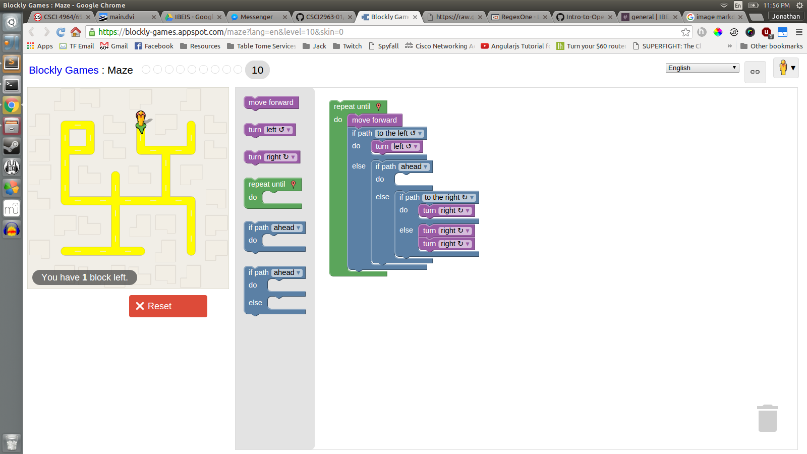

#Lab 1

Jonathan Wrona, January 1st, 2016

##Reading Assignments

###The 10 Criteria of Open Source Definition

Because I have seen this presented so many times I got to thinking about whether another criteria could be added, but didn't come up with anything to extend the 10 criteria that already exist. Based on the presentations by the OSI though it does scare me that people so easily trust when someone says that something is "open source" without researching on the matter, especially if they plan to donate to assist in the development of said "open source" project.

###Smart Questions

1. If at all possible, include error output to as much detail as possible. If you don't, those who are interested in answering your question will most likely ask for it, so save yourself some time.

2. Before asking a question, make sure to do some research on what you are trying to do first. Try to avoid falling into the trap of, "this function didn't work so I'll ask a question." Refer to the documentation first and try to fix it yourself, because if you manage to do that, you will learn much more than simply asking and receiving an answer.

##Excercises

###Install Tree

###Regex Problems

###Blockly Puzzle

##Reflection

I would like to continue a personal project of mine called *Table Tome*. Recently, the developers of the game (Wizards of the Coast) released the OGL (Open Game License) for 5th edition, which now permits me to include game content in *Table Tome*. This will allow me to complete the project to the point that I had hoped to when I thought of the idea. In returning to working on this project, I hope to go back and improve current code, as well as add more features.

